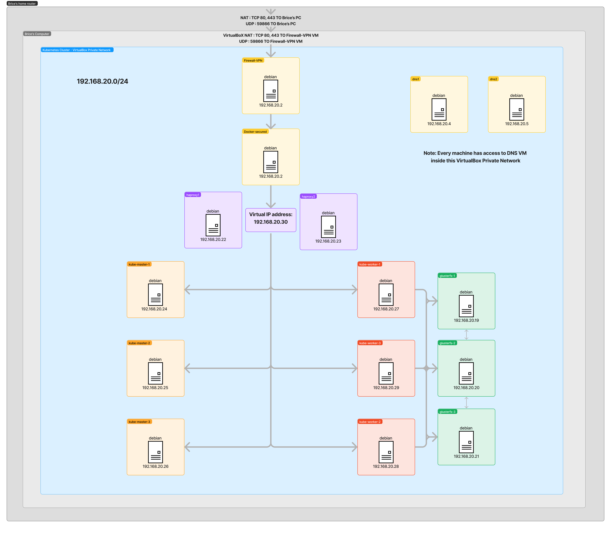
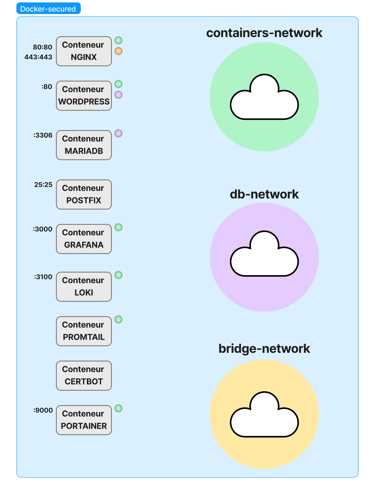
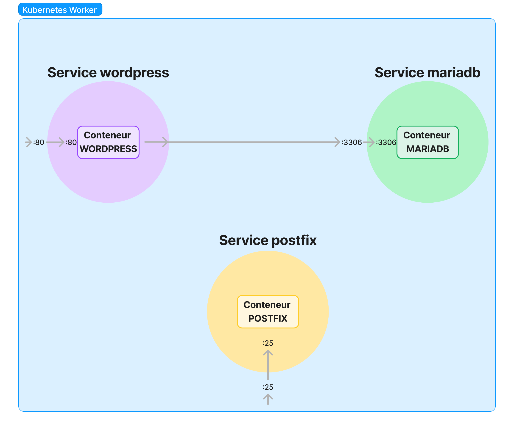

# Microservices
Kubernetes / docker microservices project  
Network description of the Virtual Machines:  
Docker **Network** : 192.168.20.0/24 **Gateway** : 192.168.20.2

Address list of the different machines 
| Machine name | Address/CIDR | Ports used |
| :---: | :---: | :---: |
| firewall | 192.168.20.2 |22, 25, 80, 443, 59866 |
| docker-secured | 192.168.20.3 |22, 80, 443 |
| dns1 | 192.168.20.4 | 22, 53 |
| dns2 | 192.168.20.5 | 22, 53 |
| glusterfs-1 | 192.168.20.5 | 22, 24007, 24008, 49152 - 49157 |
| glusterfs-2 | 192.168.20.5 | 22, 24007, 24008, 49152 - 49157 |
| glusterfs-3 | 192.168.20.5 | 22, 24007, 24008, 49152 - 49157 |
| ha-1 | 192.168.20.22 | 22, 80, 443, 25, 6443 |
| ha-2 | 192.168.20.22 | 22, 80, 443, 25, 6443 |
| kube-master-1 | 192.168.20.24 | 22, 179, 6443, 2379, 2380, 10250, 9253, 9353, 10259 |
| kube-master-2 | 192.168.20.25 | 22, 179, 6443, 2379, 2380, 10250, 9253, 9353, 10259 |
| kube-master-3 | 192.168.20.26 | 22, 179, 6443, 2379, 2380, 10250, 9253, 9353, 10259 |
| kube-worker-1 | 192.168.20.27 | 22, 179, 9253, 9353 10250, 10256 |
| kube-worker-2 | 192.168.20.28 | 22, 179, 9253, 9353 10250, 10256 |
| kube-worker-3 | 192.168.20.29 | 22, 179, 9253, 9353 10250, 10256 |
| ha-virtual-ip | 192.168.20.30 | 22, 80, 443, 25, 6443 |

Reminders:
To update certficates, run :
docker compose --rm certbot renew

You need to set the firewall as the default gateway of the docker host machine with only one private host adapter.
You also need to set the NAT to transparent on the Firewall VM to see clients ip with this command :
VBoxManage modifyvm "Debian(Firewall)" --nataliasmode1 proxyonly